# MedAssist（MedicalAssist）· 科室级临床决策支持系统（CDSS）

[](https://github.com/poincare-lijiashu/medical-agent/actions/workflows/ci.yml)


面向科室级部署的开源 CDSS 参考实现：FastAPI + LangGraph 多智能体 + Vue3 前端 + Milvus 混合检索，全链路 **PHI 脱敏 + 追加式审计 + 人在环（HITL）复核**。

> ⚠️ **免责声明**：本项目为科研与工程演示用途的临床决策**辅助**工具，**非医疗器械、未做临床注册与验证**。所有输出必须经执业医师/药师复核，不构成医疗建议，不得用于对患者的直接诊疗决策。药品字典与相互作用规则由 AI 辅助生成，使用前须经执业药师核对。请遵守所在机构的数据合规要求，接入真实患者数据前完成脱敏与授权评估。

## ✨ 项目亮点

> 📸 以下均为系统真实运行截图（内置演示数据）。

### 看得见的功能

**💊 智能开药工作台 —— 字典约束推荐（LLM 幻觉 = 0）→ 高危组合硬阻断 + 联用理由 → 一键提交 → 药师审核驳回/签发闭环**

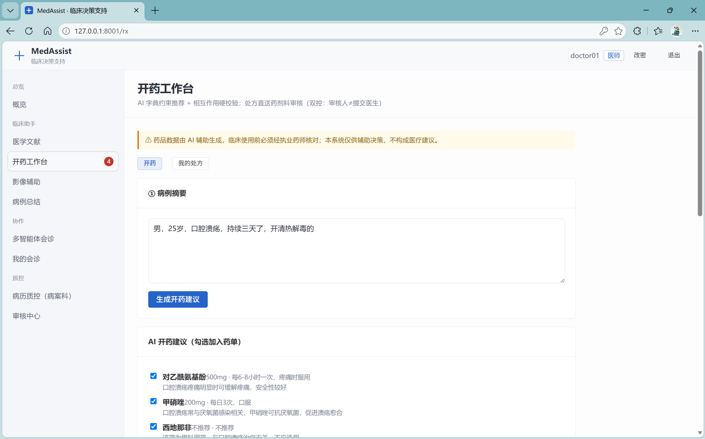

| 已选药单可编辑剂量频次，字典外药品重点标注 | 医生端实时跟踪：待审 → 驳回（附药师意见）→ 通过 |
|:---:|:---:|
| 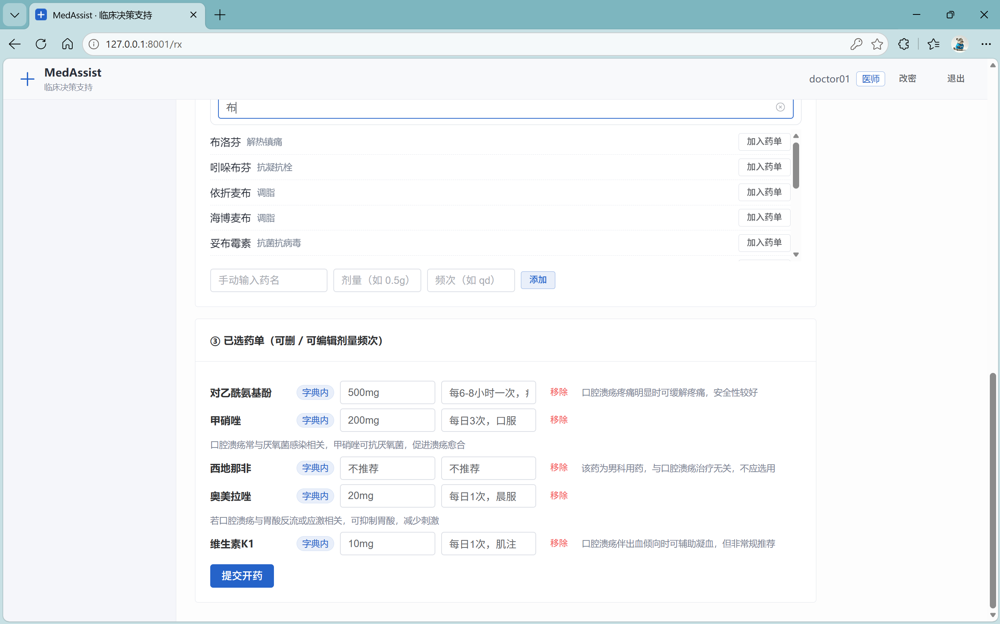 | 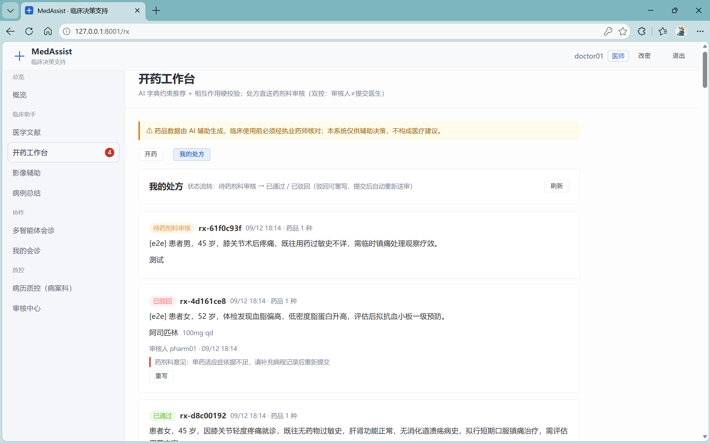 |

**⚖️ 审核中心双轨制 —— AI 自动签发（留痕模式，高危不放过）与真人药师/质控回填并行，人在环（HITL）审批全程留痕**

| 药师审核中心：处方队列逐单签发/驳回 | AI 留痕模式自动签发：置信度 / 风险 / 依据可回溯 |
|:---:|:---:|
| 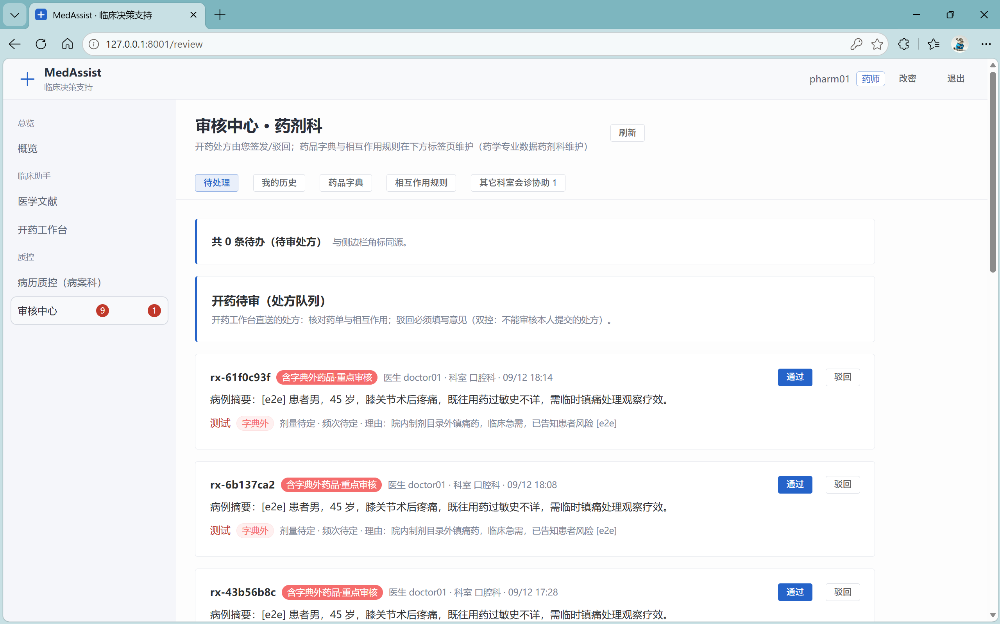 | 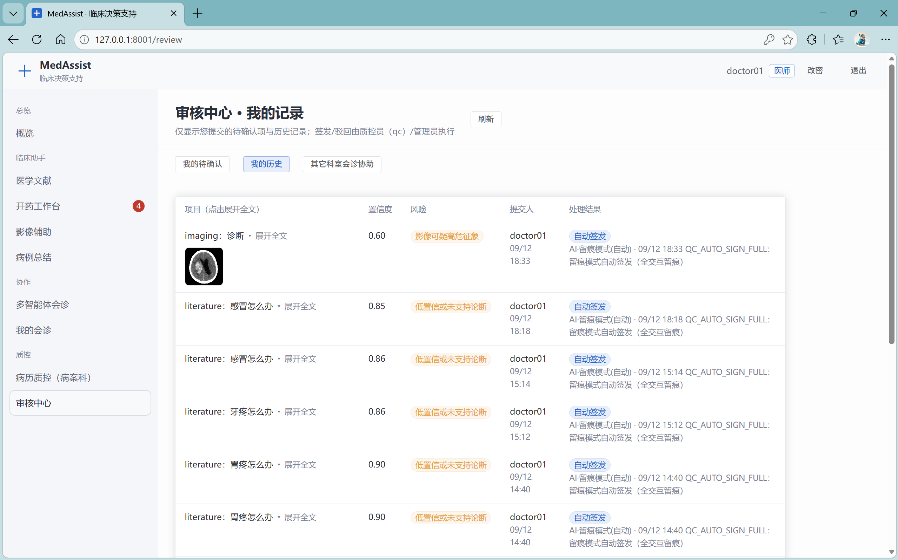 |

**🤝 MDT 多智能体会诊 —— AI 分科（附分科依据）→ 各科并行意见 → 真人并排署名**

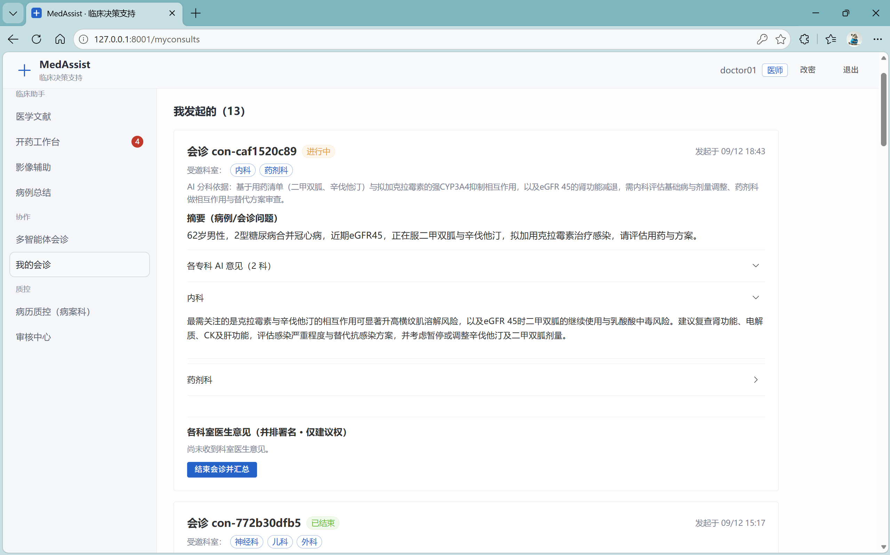

**🩻 多模态识别 —— CT 影像 / 扫描病例 / 图片 OCR，视觉模型看图给专科意见**

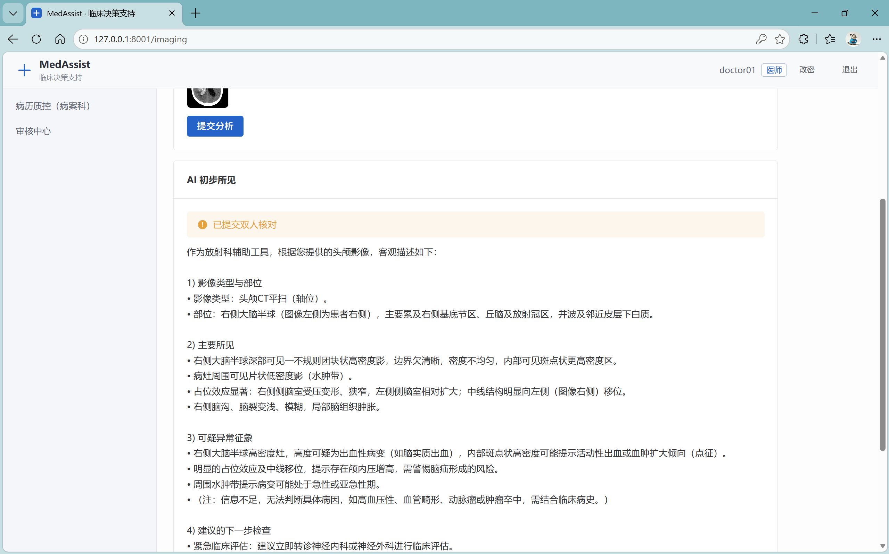

**🔀 前端即改即用的模型配置 —— 多 LLM 供应商增删 / 激活 / 连通性测试，不重启服务热切换**

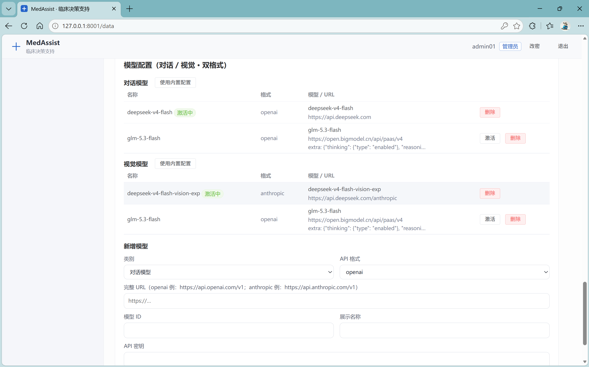

**📚 向量知识库前端管理 —— 上传 → 向量化 → 进度可见 → 删除重建，知识库连接状态实时检测**

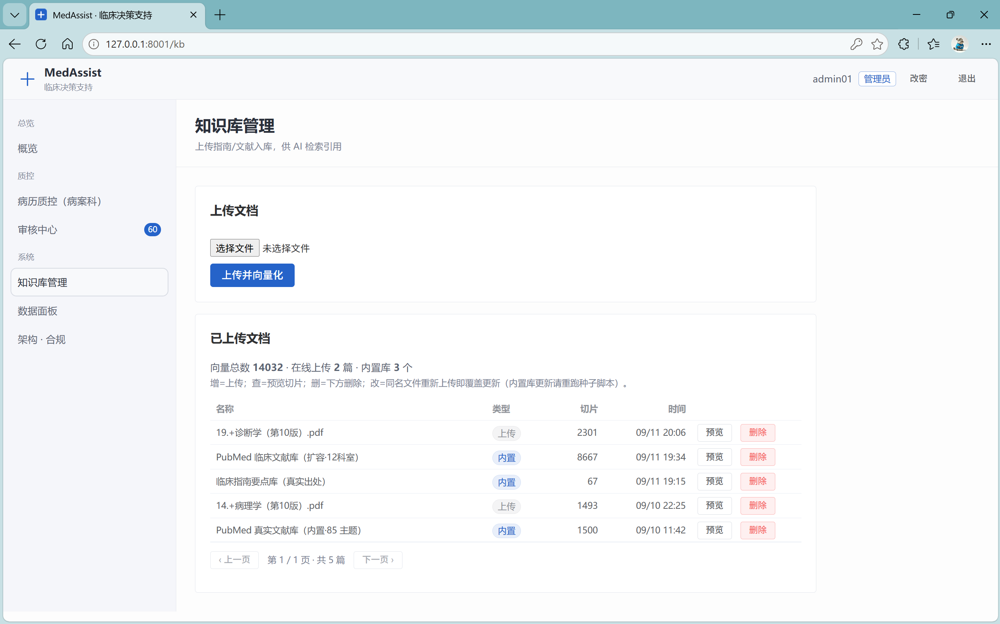

**🧰 药典规则前端维护 × 数据面板一屏总览** —— 307 条相互作用规则（高危 130 / 中危 177）药师界面维护；审核流、知识向量、审计事件、运行状态尽收一屏。

| 相互作用规则库：高危规则逐条可编辑 | 数据面板：队列 / 向量 / 审计 / 运行状态 |
|:---:|:---:|
| 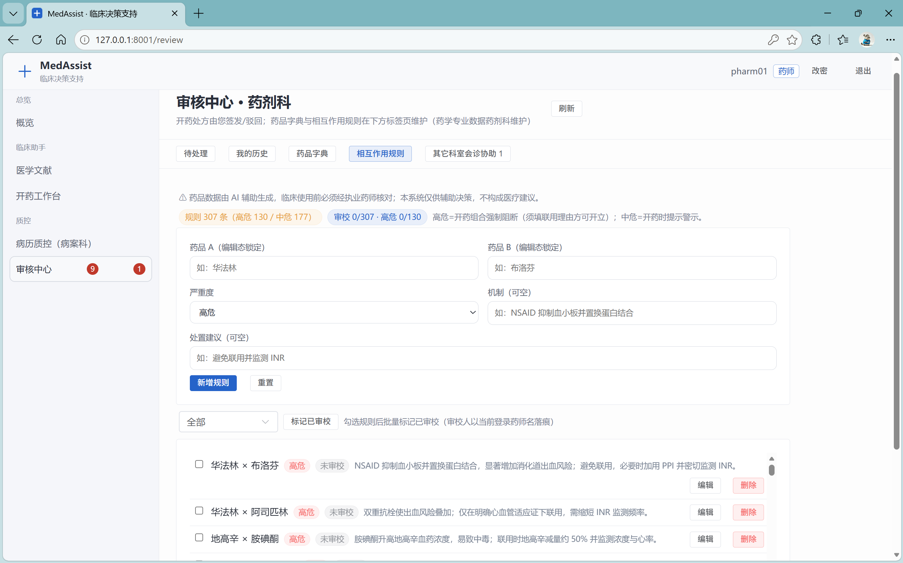 | 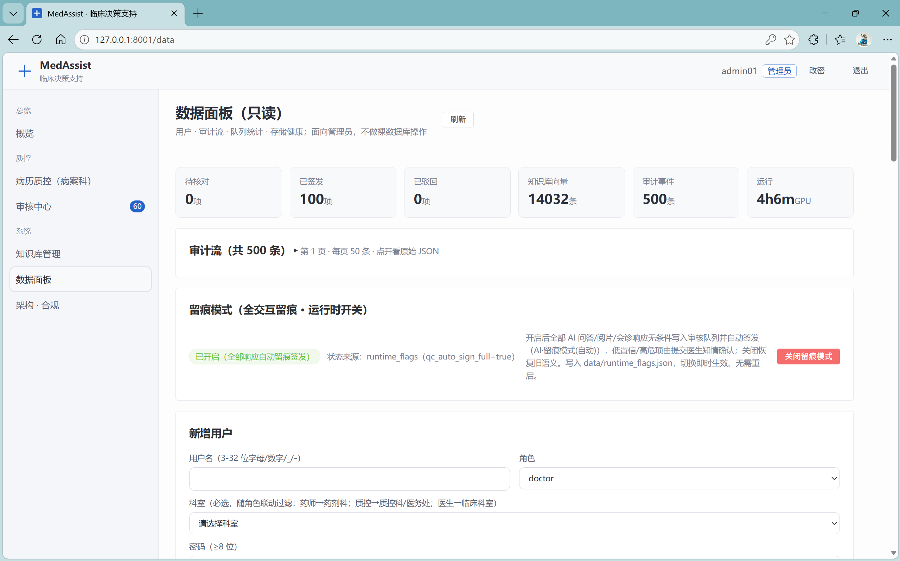 |

### 看不见的工程

- **PG 真源 + JSON 兜底**：双写原子落盘，账目不丢
- **全链 PHI 脱敏 + 追加式审计**：每一笔 AI 交互都可回溯
- **提示注入对抗测试 + 四层 SSRF 收口**：把对抗性输入挡在门外
- **16 / 64 并发压测基线**：性能不靠感觉，靠数字
- **真实恢复演练记录**：能恢复的备份才叫备份
- **GitHub Actions CI**：755 项测试全量回归

## 功能列表

| 模块 | 能力 |
|---|---|
| 📚 医学文献助手 | PubMed + 本地知识库（指南要点/PubMed 语料）稠密+稀疏 RRF 混合检索 → BGE 精排 → 循证作答，答案带 PMID/KB 出处与校准置信度，支持 SSE 流式与 agentic 检索循环 |
| 💊 药物信息助手 | 药品字典（342 种）+ 相互作用/禁忌规则库（307 条），开药工作台内置强制药师复核闭环 |
| 🩻 影像辅助阅片 | 上传影像/报告图片 → 视觉模型结构化「所见」描述，高危征象词强制医师复核 |
| 🗂 多模态病例总结 | 病例文本 + 图片 → 结构化摘要与鉴别提示 + 复核留痕 |
| 👥 MDT 多智能体会诊 | 三专科并行会诊 + 一句话结论/紧急度/建议行动前置，会诊收件箱跨科流转 |
| ✅ 病历质控 | 三轨质控：完整性规则引擎（不调 LLM）+ 内涵质量 LLM + ICD/危急值；AI 建议 → 质控员终审签字；可选 HIS 推送适配器 |
| 🛡 安全底座 | JWT 鉴权（pbkdf2 口令哈希）· 按角色（医生/药师/质控/管理员）授权 · PHI 入站脱敏 · 追加式审计（JSONL + Postgres 双写）· 限流 · 结构化日志轮转 |
| ⚙️ 管理端 | 模型配置（任意 OpenAI 兼容/Anthropic 供应商在线切换）· 药品字典/规则编辑 · 用户管理 · 数据面板 · 日志健康卡 · 运行时开关 |

## 系统架构

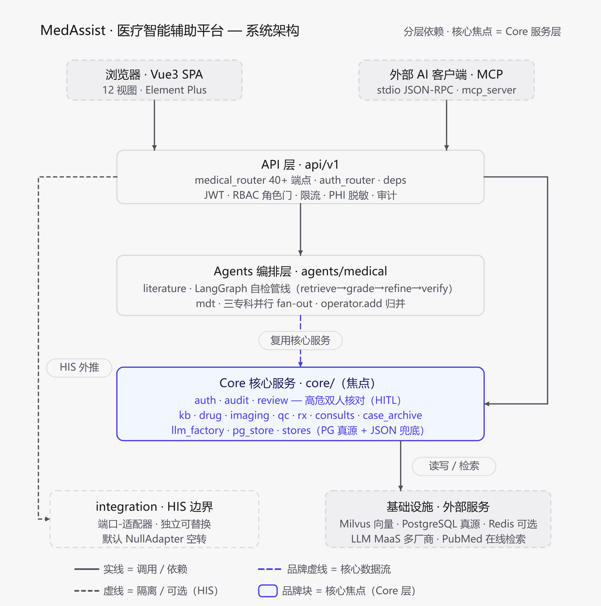

<details>
<summary><b>Mermaid 源码版架构图</b>（可编辑，点击展开）</summary>

分层架构（客户端 → 接入 → 核心域 → 智能体 → 基础设施），三层安全防线贯穿全链路：

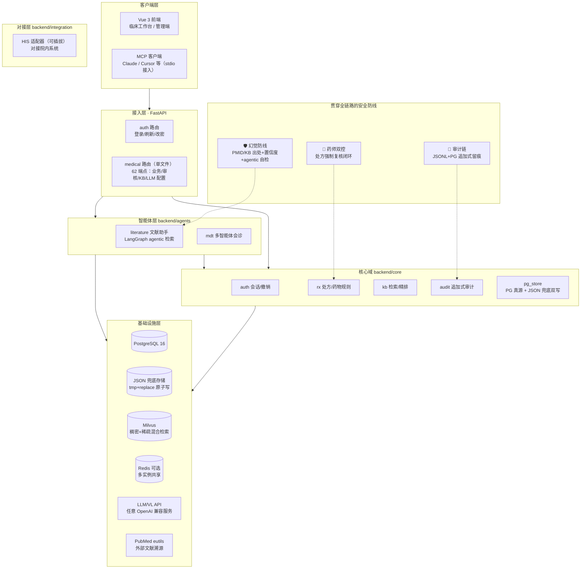

</details>

## 前置要求

- **Docker Desktop**（含 docker compose）——推荐方式，一键拉起 Milvus/Postgres/Attu + 应用
- 一个 **任意 OpenAI 兼容服务** 的 API Key（阿里云百炼 / DeepSeek / 智谱 / Kimi / OpenAI / 本地 vLLM、Ollama 网关等）
- 可选：NVIDIA GPU（首次使用会自动下载 BGE-M3 嵌入模型约 2GB；无 GPU 自动用 CPU，仅检索/嵌入较慢）
- 磁盘空间 ≥ 10GB（镜像 + 模型 + 数据）

## 快速开始

```bash
# 1. 克隆
git clone <本仓库地址> medical-assist && cd medical-assist

# 2. 配置：复制模板并填入你的 LLM API Key（支持任意 OpenAI 兼容服务）
cp .env.example .env.local        # Windows PowerShell: Copy-Item .env.example .env.local
#   编辑 .env.local → LLM_API_KEY=<你的 Key>
#   换厂商时改 LLM_BASE_URL / LLM_MODEL（DeepSeek 示例已写在模板注释里）

# 3. 一键启动（首启自动构建镜像；首次使用自动下载 BGE-M3 约 2GB，已配国内 HF_ENDPOINT 镜像）
docker compose up -d

# 4. 打开浏览器访问
#    http://localhost:8001
#    用种子账号登录：doctor01 / Med@2026
#    ⚠️ 登录后请立即改密（顶栏「修改密码」），生产部署务必关闭种子注入（AUTH_SEED_DEMO=false）
```

种子账号共 4 个（仅 `AUTH_SEED_DEMO=true` 且非生产环境时首启自动注入，口令统一取 `AUTH_DEMO_PASSWORD`）：`doctor01`（医生）/ `pharm01`（药师）/ `qc01`（质控员）/ `admin01`（管理员）。

> 完整部署（生产检查表、本地直跑、GPU 加速、三级部署、备份恢复）见 **[docs/DEPLOY.md](docs/DEPLOY.md)**，系统架构见 **[docs/ARCHITECTURE.md](docs/ARCHITECTURE.md)**。

## 常见问题

**端口被占用 / 想换端口？**
编辑 `.env.local` 的 `SERVER_PORT` 与 `docker-compose.yml` 中 app 服务的 `8001:8001` 映射；基础设施端口（PG 5433、Milvus 19530/19531、Attu 3001、MinIO 9000/9001）均只绑 127.0.0.1，如冲突同样在 compose 中调整。

**没有 NVIDIA GPU 能跑吗？**
能。`EMBED_DEVICE=auto` 时有 CUDA 用 GPU、否则自动 CPU（启动日志 `embedder.device_cuda_fallback`）；OCR 为纯 CPU 推理；LLM/视觉模型走远程 API 不占本机 GPU。GPU 仅加速嵌入/精排。

**数据都存在哪里？**
- 结构化业务数据（用户/审核队列/处方/会诊/字典等）：Postgres（`medagent_pg` 卷）+ `data/*.json` 本地兜底双写；
- 知识库向量：Milvus（`medagent_milvus-db` 卷），文档原件与清单在 `data/kb_docs/`、`data/kb/`；
- 审计日志：`data/audit/*.jsonl` + PG `audit_log`；
- 应用日志：`logs/app.log`（5MB×5 轮转）。

**如何备份 / 恢复？**
```bash
python scripts/backup.py --keep 7                                    # tar data/ + pg_dump → data/backups/
python scripts/restore.py --backup data/backups/backup_XXX.tar.gz --yes   # 先停服务再恢复（默认 dry-run）
```
最简方式：停服务后直接拷贝 `data/` 目录（bind mount 落盘，所有运行数据都在其中）。详见 docs/DEPLOY.md「数据归属表」。

**首次启动很慢？**
首次需下载 BGE-M3（约 2GB，走 `HF_ENDPOINT=https://hf-mirror.com` 国内镜像，只下载一次）+ 拉取 Milvus/PG 镜像；可用 `docker compose logs -f app` 观察进度。

## 文档

- [docs/DEPLOY.md](docs/DEPLOY.md) —— 部署、生产检查表、数据归属与备份恢复、多实例扩容
- [docs/ARCHITECTURE.md](docs/ARCHITECTURE.md) —— 系统架构、模块边界、扩展点
- [docs/archive/](docs/archive/) —— 设计过程文档（INTEGRATION/MCP/OPERATIONS/EVAL 及历史计划）
- [PRODUCT.md](PRODUCT.md) / [DESIGN.md](DESIGN.md) —— 产品定位与设计规范

## License

仅供学习与研究使用；商用/临床落地请自行完成合规评估并遵循随附许可条款。
